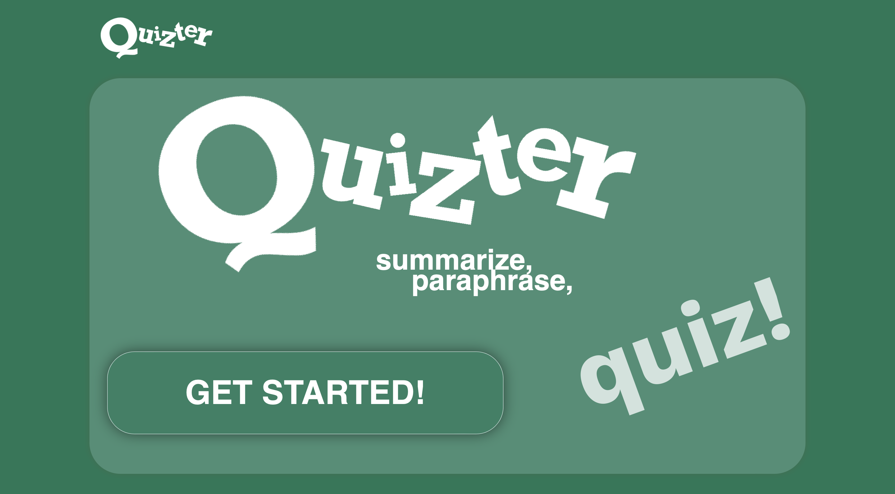
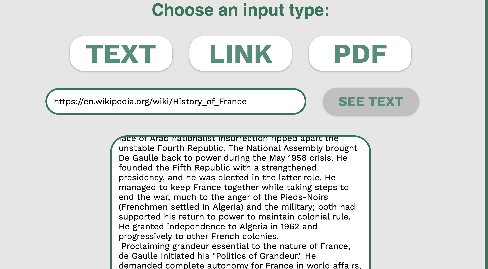
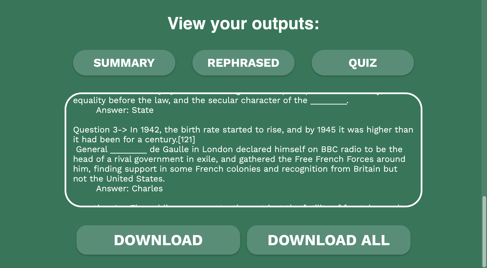

## 🧠 NLP Tasks: Text Summarization, Paraphrasing & MCQ Generation

---



---

This project uses Natural Language Processing (NLP) techniques to perform **automated summarization**, **paraphrasing**, and **multiple-choice question (MCQ) generation**. It supports multilingual inputs and handles Tamil-to-English translation before processing.

The core functionalities include:

- Text summarization using extractive techniques  
- Paraphrase generation using semantic models  
- Automatic MCQ quiz generation from long text passages

---



---

## 📁 Project Structure

- `summarize.py`: Summarizes long English or Tamil passages  
- `paraphrase.py`: Rephrases sentences using semantic matching  
- `MCQ.py`: Generates multiple-choice questions from text  
- `quizzApp/utils/`: *(not included here)* Utility functions and dependencies  
- `frontend/`: React frontend interface  
- `manage.py`: Django backend entry point

---

## 🔧 Technologies Used

- Python 3.x  
- Django (backend server)  
- React.js (frontend app)  
- SpaCy – NLP pipeline  
- Transformers – for paraphrasing and semantic tasks  
- Googletrans / LangDetect – for language detection and translation

---

## 📊 Data Cleaning

- Basic preprocessing using:
  - `string.punctuation` removal  
  - Tamil language detection via `langdetect`  
  - Auto translation to English via `googletrans`  

---

## 🔍 Summarization

- Uses SpaCy sentence extraction for summarizing text:
```python
from summarize import generate_summary
summary = generate_summary(text)
```

---

## ⚙️ Paraphrasing

- Uses semantic similarity models to rephrase content while maintaining meaning:
```python
from paraphrase import generate_paraphrase
paraphrased_text = generate_paraphrase("Original input sentence or paragraph.")
```
- Automatically detects and translates Tamil input before processing
- Ensures minimum text length for reliable output
- Useful for simplifying or rewriting academic and educational content

---


---

## 📌 MCQ Generation

- Extracts named entities and key concepts to generate quiz-style multiple-choice questions:
```python
from MCQ import MCQ_output
questions = MCQ_output("Input text passage")
```
- Performs sentence segmentation, named entity recognition, and distractor generation
- Designed for learning applications, exam prep, and content comprehension
  
---

## 📈 Multilingual Support

- Tamil language is detected using langdetect:
```python
from langdetect import detect
if detect(text[:500]) == 'ta':
    text = translate_tamil_to_english(text)
```
- Translates Tamil input via googletrans
-All NLP pipelines are designed for English processing using SpaCy and sentence transformers

---

## 🚀 Project Setup
- In the first terminal (Backend)
- Navigate to the root project folder Quizzter/
- Create and activate a virtual environment:
```python
python -m venv venv
source venv/bin/activate  # On Windows: venv\Scripts\activate
```
- Install backend dependencies:
```python
pip install -r requirements.txt
```
- Download necessary NLP models:
```python
python -m spacy download en_core_web_sm
python -m spacy download en_core_web_lg
```
- Run the backend server:
```python
python manage.py runserver 8080
```
- 💡 On macOS, use python3 and pip3 instead if needed
- 💻 In the second terminal (Frontend)
- Navigate again to the root project: Quizzter/
- Go to the frontend folder:
```python
cd frontend
```
- Install frontend dependencies:
```python
npm install
```
- Start the React development server:
```python
npm start
```
---



---

## 📬 Contact :

- Youssef Benaouda, Freelancer in AI
- Mail : benaoudayoussef123@gmail.com
- Active on LinkedIn


